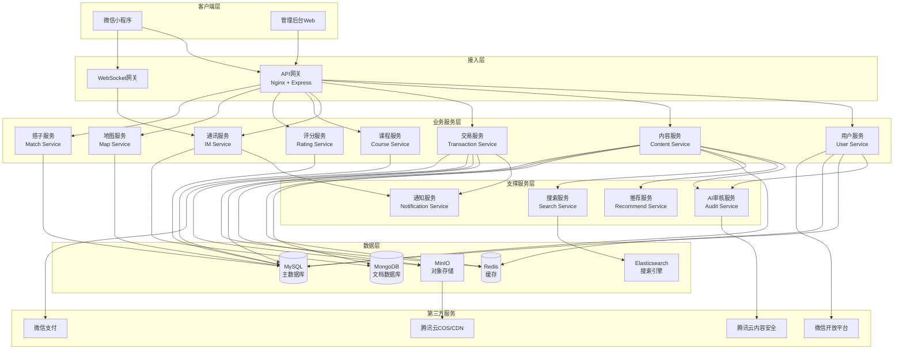
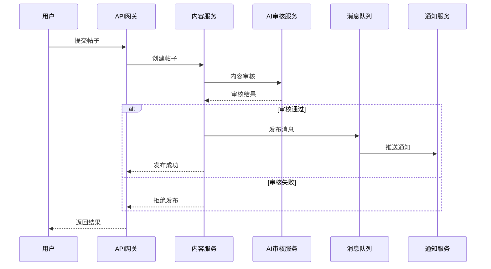
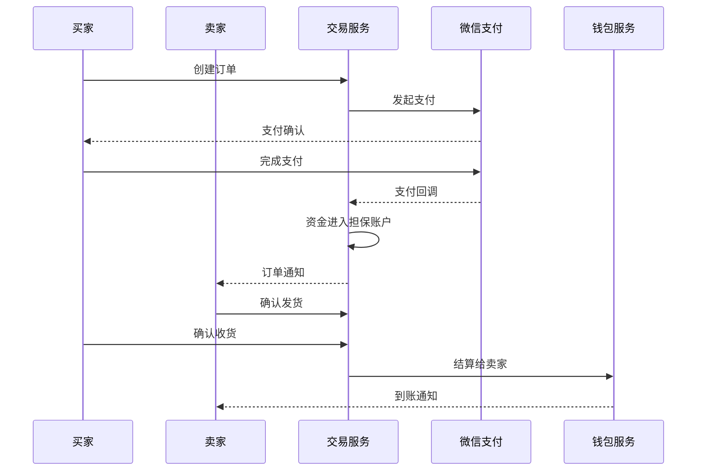
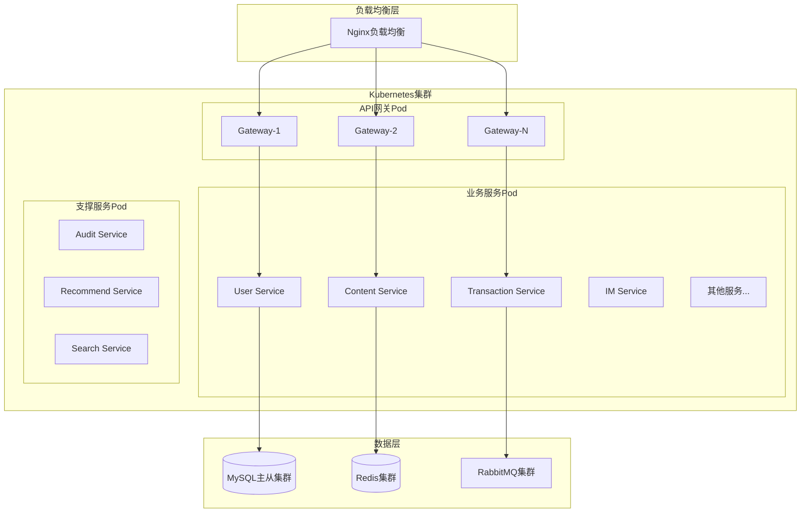

# 知域校园互动社交平台设计文档

## 简介

本文档描述知域校园互动社交平台的技术设计方案。知域是专属单校/多校大学生的全场景闭环校园互动社交服务平台，整合校园圈子、跑腿服务、二手交易、课程资料、评分评价、地图导航、兴趣组队等核心功能。

本设计文档基于已完成的需求文档，定义系统架构、数据模型、接口设计、安全策略和性能优化方案。

## 概述

### 系统目标

- 为大学生提供一站式校园生活服务平台
- 支持多校部署，数据完全隔离
- 保障交易安全和内容合规
- 提供高性能、高可用的服务体验
- 支持水平扩展和功能迭代

### 技术栈选型

**前端技术栈:**
- 微信小程序原生框架
- WeUI组件库
- MobX状态管理
- Day.js时间处理

**后端技术栈:**
- Node.js + Express.js (API网关)
- Java Spring Boot (核心业务服务)
- Python FastAPI (AI审核服务)
- Redis (缓存和会话)
- RabbitMQ (消息队列)
- MySQL 8.0 (关系型数据库)
- MongoDB (非结构化数据)
- Elasticsearch (全文搜索)
- MinIO (对象存储)

**基础设施:**
- Docker + Kubernetes (容器编排)
- Nginx (负载均衡和反向代理)
- 腾讯云COS (CDN加速)
- 微信支付 (支付服务)
- 腾讯云内容安全 (AI审核)


## 架构设计

### 整体架构

系统采用微服务架构，按业务领域拆分为多个独立服务，通过API网关统一对外提供服务。



### 服务职责划分

**用户服务 (User Service)**
- 用户注册与微信授权
- 校园身份认证
- 用户档案管理
- 信用分计算与管理
- 权限验证
- 积分体系

**内容服务 (Content Service)**
- 圈子管理
- 帖子发布与审核
- 帖子互动（点赞、评论、转发）
- 内容推荐
- 举报处理

**交易服务 (Transaction Service)**
- 跑腿订单管理
- 二手商品管理
- 担保交易
- 订单状态流转
- 评价管理
- 钱包与提现

**通讯服务 (IM Service)**
- 一对一私信
- 群组聊天
- 消息推送
- 在线状态管理
- 消息存储与同步

**课程服务 (Course Service)**
- 课程库管理
- 课程资料上传与下载
- 资料审核
- 课程交流区

**评分服务 (Rating Service)**
- 评分主体管理
- 评分与评价
- 榜单生成
- 主体认领

**地图服务 (Map Service)**
- 地图数据管理
- 点位标注
- 路径规划
- 室内导航

**搭子服务 (Match Service)**
- 招募帖发布
- 申请与审核
- 小组管理
- 智能匹配推荐

**AI审核服务 (Audit Service)**
- 敏感词检测
- 图片鉴黄
- 文本分类
- 风险评估

**推荐服务 (Recommend Service)**
- 用户兴趣建模
- 内容特征提取
- 协同过滤推荐
- 个性化排序

**搜索服务 (Search Service)**
- 全文索引
- 关键词搜索
- 搜索建议
- 热门搜索统计

**通知服务 (Notification Service)**
- 消息推送
- 订阅管理
- 推送记录
- 模板管理

### 数据流转

**内容发布流程:**


**交易流程:**


### 部署架构

采用Kubernetes容器编排，支持弹性伸缩和灰度发布。




## 组件与接口

### API设计原则

- 遵循RESTful设计规范
- 使用HTTPS加密传输
- 统一的请求响应格式
- 版本化管理（/api/v1/）
- 接口幂等性保证
- 频率限制和防刷机制

### 统一响应格式

```json
{
  "code": 200,
  "message": "success",
  "data": {},
  "timestamp": 1234567890,
  "requestId": "uuid"
}
```

错误响应：
```json
{
  "code": 400,
  "message": "参数错误",
  "error": "详细错误信息",
  "timestamp": 1234567890,
  "requestId": "uuid"
}
```

### 核心接口定义

#### 用户服务接口

**用户注册与认证**
```
POST /api/v1/auth/wechat-login
请求: { code: string }
响应: { token: string, user: UserInfo }

POST /api/v1/auth/verify-identity
请求: { studentId: string, name: string, email: string }
响应: { verified: boolean, userId: string }

GET /api/v1/users/{userId}
响应: UserProfile

PUT /api/v1/users/{userId}/profile
请求: { nickname, avatar, tags, ... }
响应: UserProfile

GET /api/v1/users/{userId}/credit
响应: { score: number, history: CreditHistory[] }
```

#### 内容服务接口

**圈子与帖子**
```
GET /api/v1/circles
响应: Circle[]

GET /api/v1/circles/{circleId}/posts
查询参数: page, size, sort
响应: { posts: Post[], total: number }

POST /api/v1/posts
请求: { title, content, circleId, type, anonymous, ... }
响应: Post

GET /api/v1/posts/{postId}
响应: PostDetail

POST /api/v1/posts/{postId}/like
响应: { liked: boolean, likeCount: number }

POST /api/v1/posts/{postId}/comments
请求: { content, parentId, ... }
响应: Comment

DELETE /api/v1/posts/{postId}
响应: { success: boolean }
```

#### 交易服务接口

**跑腿订单**
```
POST /api/v1/errands
请求: { 
  type, pickupAddress, deliveryAddress, 
  expectedTime, fee, tip, description, ... 
}
响应: ErrandOrder

GET /api/v1/errands
查询参数: status, type, page, size
响应: { orders: ErrandOrder[], total: number }

POST /api/v1/errands/{orderId}/accept
响应: ErrandOrder

PUT /api/v1/errands/{orderId}/status
请求: { status, location, photo, ... }
响应: ErrandOrder

POST /api/v1/errands/{orderId}/complete
响应: ErrandOrder

POST /api/v1/errands/{orderId}/rate
请求: { rating, comment, ... }
响应: { success: boolean }
```

**二手交易**
```
POST /api/v1/secondhand/items
请求: { 
  name, category, condition, price, 
  originalPrice, images, description, ... 
}
响应: SecondhandItem

GET /api/v1/secondhand/items
查询参数: category, priceMin, priceMax, campus, page, size
响应: { items: SecondhandItem[], total: number }

GET /api/v1/secondhand/items/{itemId}
响应: SecondhandItemDetail

POST /api/v1/secondhand/orders
请求: { itemId, tradeType, ... }
响应: SecondhandOrder

PUT /api/v1/secondhand/orders/{orderId}/confirm
响应: SecondhandOrder
```

#### 课程服务接口

**课程与资料**
```
GET /api/v1/courses
查询参数: school, department, major, keyword, page, size
响应: { courses: Course[], total: number }

GET /api/v1/courses/{courseId}
响应: CourseDetail

POST /api/v1/courses/{courseId}/materials
请求: { 
  name, type, file, description, 
  downloadPermission, pointsCost, ... 
}
响应: Material

GET /api/v1/courses/{courseId}/materials
响应: Material[]

GET /api/v1/materials/{materialId}/download
响应: { url: string, expiresIn: number }

POST /api/v1/courses/{courseId}/discussions
请求: { content, ... }
响应: Discussion
```

#### 评分服务接口

**评分与评价**
```
GET /api/v1/rating/subjects
查询参数: type, keyword, page, size
响应: { subjects: RatingSubject[], total: number }

POST /api/v1/rating/subjects/{subjectId}/ratings
请求: { 
  dimensions: { [key]: score }, 
  comment, images, tags, ... 
}
响应: Rating

GET /api/v1/rating/subjects/{subjectId}/ratings
响应: { ratings: Rating[], average: DimensionScores }

GET /api/v1/rating/rankings
查询参数: type, dimension, campus, page, size
响应: RankingList[]
```

#### 通讯服务接口

**即时通讯**
```
WebSocket /ws/im?token={token}

消息格式:
{
  type: "text" | "image" | "voice" | "location",
  from: userId,
  to: userId | groupId,
  content: any,
  timestamp: number
}

GET /api/v1/im/conversations
响应: Conversation[]

GET /api/v1/im/messages
查询参数: conversationId, before, limit
响应: Message[]

POST /api/v1/im/messages/{messageId}/recall
响应: { success: boolean }
```

#### 搭子服务接口

**招募与组队**
```
POST /api/v1/matches/recruitments
请求: { 
  title, category, time, location, 
  memberCount, requirements, isPublic, ... 
}
响应: Recruitment

GET /api/v1/matches/recruitments
查询参数: category, time, campus, page, size
响应: { recruitments: Recruitment[], total: number }

POST /api/v1/matches/recruitments/{recruitmentId}/apply
请求: { message, ... }
响应: Application

PUT /api/v1/matches/applications/{applicationId}/approve
响应: { groupId: string }

GET /api/v1/matches/groups/{groupId}
响应: GroupDetail

POST /api/v1/matches/groups/{groupId}/announcements
请求: { content, ... }
响应: Announcement
```

#### 地图服务接口

**地图与导航**
```
GET /api/v1/map/pois
查询参数: type, keyword, campus
响应: POI[]

GET /api/v1/map/pois/{poiId}
响应: POIDetail

POST /api/v1/map/navigation
请求: { from: Location, to: Location, mode: string }
响应: { route: Route, distance: number, duration: number }

GET /api/v1/map/indoor/{buildingId}
查询参数: floor
响应: IndoorMap
```

#### 搜索服务接口

**全局搜索**
```
GET /api/v1/search
查询参数: keyword, type, page, size
响应: { 
  posts: Post[], 
  items: SecondhandItem[], 
  courses: Course[], 
  users: User[] 
}

GET /api/v1/search/suggestions
查询参数: keyword
响应: string[]

GET /api/v1/search/hot
响应: HotKeyword[]
```

### 接口鉴权

使用JWT Token进行身份验证：

```
Authorization: Bearer {token}
```

Token包含信息：
- userId: 用户ID
- schoolId: 学校ID
- role: 用户角色
- permissions: 权限列表
- exp: 过期时间

权限验证流程：
1. API网关验证Token有效性
2. 解析Token获取用户信息
3. 根据接口要求验证权限
4. 将用户信息传递给业务服务

### 接口限流策略

**限流规则:**
- 普通用户：100次/分钟
- 认证用户：200次/分钟
- VIP用户：500次/分钟
- 管理员：无限制

**限流实现:**
- 使用Redis + Lua脚本实现滑动窗口限流
- 超出限制返回429状态码
- 响应头包含限流信息：
  - X-RateLimit-Limit: 限制次数
  - X-RateLimit-Remaining: 剩余次数
  - X-RateLimit-Reset: 重置时间


## 数据模型

### 数据库选型

**MySQL (关系型数据库)**
- 用户数据、认证信息
- 订单数据、交易记录
- 课程数据、评分数据
- 结构化业务数据

**MongoDB (文档数据库)**
- 帖子内容、评论数据
- 聊天消息记录
- 日志数据
- 灵活schema的数据

**Redis (缓存)**
- 会话信息
- 热点数据缓存
- 分布式锁
- 消息队列

**Elasticsearch (搜索引擎)**
- 全文搜索索引
- 日志分析
- 数据聚合统计

### 核心数据模型

#### 用户相关

**用户表 (users)**
```sql
CREATE TABLE users (
  id BIGINT PRIMARY KEY AUTO_INCREMENT,
  wechat_openid VARCHAR(64) UNIQUE NOT NULL,
  wechat_unionid VARCHAR(64),
  nickname VARCHAR(50),
  avatar VARCHAR(255),
  school_id BIGINT NOT NULL,
  student_id VARCHAR(50),
  real_name VARCHAR(50),
  email VARCHAR(100),
  phone VARCHAR(20),
  role ENUM('student', 'teacher', 'merchant', 'admin') DEFAULT 'student',
  verified BOOLEAN DEFAULT FALSE,
  credit_score INT DEFAULT 80,
  points INT DEFAULT 0,
  status ENUM('active', 'banned', 'deleted') DEFAULT 'active',
  created_at TIMESTAMP DEFAULT CURRENT_TIMESTAMP,
  updated_at TIMESTAMP DEFAULT CURRENT_TIMESTAMP ON UPDATE CURRENT_TIMESTAMP,
  INDEX idx_school_id (school_id),
  INDEX idx_student_id (student_id),
  INDEX idx_credit_score (credit_score)
);
```

**用户档案表 (user_profiles)**
```sql
CREATE TABLE user_profiles (
  user_id BIGINT PRIMARY KEY,
  grade VARCHAR(20),
  major VARCHAR(100),
  campus VARCHAR(50),
  tags JSON,
  bio TEXT,
  privacy_settings JSON,
  FOREIGN KEY (user_id) REFERENCES users(id) ON DELETE CASCADE
);
```

**信用记录表 (credit_logs)**
```sql
CREATE TABLE credit_logs (
  id BIGINT PRIMARY KEY AUTO_INCREMENT,
  user_id BIGINT NOT NULL,
  change_amount INT NOT NULL,
  reason VARCHAR(255),
  related_type ENUM('post', 'order', 'rating', 'violation'),
  related_id BIGINT,
  created_at TIMESTAMP DEFAULT CURRENT_TIMESTAMP,
  FOREIGN KEY (user_id) REFERENCES users(id) ON DELETE CASCADE,
  INDEX idx_user_id (user_id),
  INDEX idx_created_at (created_at)
);
```

**积分记录表 (point_logs)**
```sql
CREATE TABLE point_logs (
  id BIGINT PRIMARY KEY AUTO_INCREMENT,
  user_id BIGINT NOT NULL,
  change_amount INT NOT NULL,
  action_type VARCHAR(50),
  description VARCHAR(255),
  created_at TIMESTAMP DEFAULT CURRENT_TIMESTAMP,
  FOREIGN KEY (user_id) REFERENCES users(id) ON DELETE CASCADE,
  INDEX idx_user_id (user_id)
);
```

#### 内容相关

**圈子表 (circles)**
```sql
CREATE TABLE circles (
  id BIGINT PRIMARY KEY AUTO_INCREMENT,
  school_id BIGINT NOT NULL,
  name VARCHAR(100) NOT NULL,
  description TEXT,
  icon VARCHAR(255),
  type ENUM('official', 'custom') DEFAULT 'custom',
  creator_id BIGINT,
  admin_ids JSON,
  member_count INT DEFAULT 0,
  post_count INT DEFAULT 0,
  status ENUM('active', 'archived') DEFAULT 'active',
  created_at TIMESTAMP DEFAULT CURRENT_TIMESTAMP,
  updated_at TIMESTAMP DEFAULT CURRENT_TIMESTAMP ON UPDATE CURRENT_TIMESTAMP,
  FOREIGN KEY (school_id) REFERENCES schools(id),
  FOREIGN KEY (creator_id) REFERENCES users(id),
  INDEX idx_school_id (school_id),
  INDEX idx_type (type)
);
```

**帖子表 (posts) - MongoDB**
```javascript
{
  _id: ObjectId,
  postId: Long,
  schoolId: Long,
  circleId: Long,
  authorId: Long,
  title: String,
  content: String,
  type: String, // "text", "image", "video", "poll", "question"
  images: [String],
  videos: [String],
  pollOptions: [{
    option: String,
    voteCount: Number,
    voters: [Long]
  }],
  tags: [String],
  isAnonymous: Boolean,
  viewCount: Number,
  likeCount: Number,
  commentCount: Number,
  shareCount: Number,
  collectCount: Number,
  status: String, // "pending", "approved", "rejected", "deleted"
  auditResult: {
    passed: Boolean,
    reason: String,
    keywords: [String]
  },
  isPinned: Boolean,
  isFeatured: Boolean,
  createdAt: Date,
  updatedAt: Date
}
```

**评论表 (comments) - MongoDB**
```javascript
{
  _id: ObjectId,
  commentId: Long,
  postId: Long,
  authorId: Long,
  content: String,
  parentId: Long,
  replyToUserId: Long,
  likeCount: Number,
  isAnonymous: Boolean,
  status: String,
  createdAt: Date
}
```

**互动记录表 (interactions)**
```sql
CREATE TABLE interactions (
  id BIGINT PRIMARY KEY AUTO_INCREMENT,
  user_id BIGINT NOT NULL,
  target_type ENUM('post', 'comment', 'item', 'material'),
  target_id BIGINT NOT NULL,
  action_type ENUM('like', 'collect', 'share', 'view'),
  created_at TIMESTAMP DEFAULT CURRENT_TIMESTAMP,
  FOREIGN KEY (user_id) REFERENCES users(id) ON DELETE CASCADE,
  UNIQUE KEY uk_user_target_action (user_id, target_type, target_id, action_type),
  INDEX idx_target (target_type, target_id),
  INDEX idx_user_id (user_id)
);
```

#### 交易相关

**跑腿订单表 (errand_orders)**
```sql
CREATE TABLE errand_orders (
  id BIGINT PRIMARY KEY AUTO_INCREMENT,
  order_no VARCHAR(32) UNIQUE NOT NULL,
  school_id BIGINT NOT NULL,
  publisher_id BIGINT NOT NULL,
  acceptor_id BIGINT,
  type ENUM('pickup', 'food', 'delivery', 'queue', 'other'),
  pickup_address VARCHAR(255),
  delivery_address VARCHAR(255),
  expected_time TIMESTAMP,
  item_type VARCHAR(100),
  item_weight DECIMAL(10,2),
  pickup_code VARCHAR(50),
  special_requirements TEXT,
  fee DECIMAL(10,2) NOT NULL,
  tip DECIMAL(10,2) DEFAULT 0,
  deposit DECIMAL(10,2) DEFAULT 0,
  status ENUM('pending', 'accepted', 'picking', 'delivering', 'completed', 'cancelled', 'disputed'),
  accept_time TIMESTAMP,
  complete_time TIMESTAMP,
  cancel_reason VARCHAR(255),
  publisher_rating INT,
  acceptor_rating INT,
  created_at TIMESTAMP DEFAULT CURRENT_TIMESTAMP,
  updated_at TIMESTAMP DEFAULT CURRENT_TIMESTAMP ON UPDATE CURRENT_TIMESTAMP,
  FOREIGN KEY (school_id) REFERENCES schools(id),
  FOREIGN KEY (publisher_id) REFERENCES users(id),
  FOREIGN KEY (acceptor_id) REFERENCES users(id),
  INDEX idx_school_id (school_id),
  INDEX idx_status (status),
  INDEX idx_publisher_id (publisher_id),
  INDEX idx_acceptor_id (acceptor_id)
);
```

**二手商品表 (secondhand_items)**
```sql
CREATE TABLE secondhand_items (
  id BIGINT PRIMARY KEY AUTO_INCREMENT,
  school_id BIGINT NOT NULL,
  seller_id BIGINT NOT NULL,
  category ENUM('textbook', 'digital', 'clothing', 'cosmetics', 'daily', 'sports', 'ticket', 'other'),
  name VARCHAR(200) NOT NULL,
  description TEXT,
  images JSON,
  videos JSON,
  condition_level ENUM('new', 'like_new', 'good', 'fair'),
  price DECIMAL(10,2) NOT NULL,
  original_price DECIMAL(10,2),
  trade_type ENUM('sell', 'exchange', 'both'),
  campus VARCHAR(50),
  pickup_address VARCHAR(255),
  related_course_id BIGINT,
  view_count INT DEFAULT 0,
  collect_count INT DEFAULT 0,
  status ENUM('available', 'reserved', 'sold', 'removed'),
  created_at TIMESTAMP DEFAULT CURRENT_TIMESTAMP,
  updated_at TIMESTAMP DEFAULT CURRENT_TIMESTAMP ON UPDATE CURRENT_TIMESTAMP,
  FOREIGN KEY (school_id) REFERENCES schools(id),
  FOREIGN KEY (seller_id) REFERENCES users(id),
  INDEX idx_school_id (school_id),
  INDEX idx_category (category),
  INDEX idx_status (status),
  INDEX idx_seller_id (seller_id)
);
```

**二手交易订单表 (secondhand_orders)**
```sql
CREATE TABLE secondhand_orders (
  id BIGINT PRIMARY KEY AUTO_INCREMENT,
  order_no VARCHAR(32) UNIQUE NOT NULL,
  item_id BIGINT NOT NULL,
  seller_id BIGINT NOT NULL,
  buyer_id BIGINT NOT NULL,
  trade_type ENUM('offline', 'escrow'),
  amount DECIMAL(10,2),
  status ENUM('pending', 'paid', 'confirmed', 'completed', 'cancelled', 'disputed'),
  payment_time TIMESTAMP,
  confirm_time TIMESTAMP,
  complete_time TIMESTAMP,
  buyer_rating INT,
  seller_rating INT,
  created_at TIMESTAMP DEFAULT CURRENT_TIMESTAMP,
  updated_at TIMESTAMP DEFAULT CURRENT_TIMESTAMP ON UPDATE CURRENT_TIMESTAMP,
  FOREIGN KEY (item_id) REFERENCES secondhand_items(id),
  FOREIGN KEY (seller_id) REFERENCES users(id),
  FOREIGN KEY (buyer_id) REFERENCES users(id),
  INDEX idx_seller_id (seller_id),
  INDEX idx_buyer_id (buyer_id),
  INDEX idx_status (status)
);
```

**钱包表 (wallets)**
```sql
CREATE TABLE wallets (
  id BIGINT PRIMARY KEY AUTO_INCREMENT,
  user_id BIGINT UNIQUE NOT NULL,
  balance DECIMAL(10,2) DEFAULT 0,
  frozen_amount DECIMAL(10,2) DEFAULT 0,
  total_income DECIMAL(10,2) DEFAULT 0,
  total_expense DECIMAL(10,2) DEFAULT 0,
  updated_at TIMESTAMP DEFAULT CURRENT_TIMESTAMP ON UPDATE CURRENT_TIMESTAMP,
  FOREIGN KEY (user_id) REFERENCES users(id) ON DELETE CASCADE
);
```

**交易流水表 (transactions)**
```sql
CREATE TABLE transactions (
  id BIGINT PRIMARY KEY AUTO_INCREMENT,
  transaction_no VARCHAR(32) UNIQUE NOT NULL,
  user_id BIGINT NOT NULL,
  type ENUM('recharge', 'withdraw', 'payment', 'refund', 'income'),
  amount DECIMAL(10,2) NOT NULL,
  balance_after DECIMAL(10,2),
  related_order_type VARCHAR(50),
  related_order_id BIGINT,
  status ENUM('pending', 'success', 'failed'),
  remark VARCHAR(255),
  created_at TIMESTAMP DEFAULT CURRENT_TIMESTAMP,
  FOREIGN KEY (user_id) REFERENCES users(id),
  INDEX idx_user_id (user_id),
  INDEX idx_transaction_no (transaction_no),
  INDEX idx_created_at (created_at)
);
```

#### 课程相关

**学校表 (schools)**
```sql
CREATE TABLE schools (
  id BIGINT PRIMARY KEY AUTO_INCREMENT,
  name VARCHAR(200) NOT NULL,
  short_name VARCHAR(50),
  province VARCHAR(50),
  city VARCHAR(50),
  logo VARCHAR(255),
  status ENUM('active', 'inactive') DEFAULT 'active',
  created_at TIMESTAMP DEFAULT CURRENT_TIMESTAMP
);
```

**课程表 (courses)**
```sql
CREATE TABLE courses (
  id BIGINT PRIMARY KEY AUTO_INCREMENT,
  school_id BIGINT NOT NULL,
  code VARCHAR(50),
  name VARCHAR(200) NOT NULL,
  department VARCHAR(100),
  major VARCHAR(100),
  teacher VARCHAR(100),
  credits DECIMAL(3,1),
  exam_type ENUM('exam', 'assessment', 'practice'),
  semester VARCHAR(20),
  syllabus TEXT,
  rating_count INT DEFAULT 0,
  avg_rating DECIMAL(3,2),
  created_at TIMESTAMP DEFAULT CURRENT_TIMESTAMP,
  updated_at TIMESTAMP DEFAULT CURRENT_TIMESTAMP ON UPDATE CURRENT_TIMESTAMP,
  FOREIGN KEY (school_id) REFERENCES schools(id),
  INDEX idx_school_id (school_id),
  INDEX idx_department (department),
  INDEX idx_teacher (teacher)
);
```

**课程资料表 (course_materials)**
```sql
CREATE TABLE course_materials (
  id BIGINT PRIMARY KEY AUTO_INCREMENT,
  course_id BIGINT NOT NULL,
  uploader_id BIGINT NOT NULL,
  name VARCHAR(200) NOT NULL,
  type ENUM('courseware', 'outline', 'exam', 'homework', 'report', 'notes', 'other'),
  file_url VARCHAR(500),
  file_size BIGINT,
  file_type VARCHAR(50),
  description TEXT,
  download_permission ENUM('free', 'points'),
  points_cost INT DEFAULT 0,
  download_count INT DEFAULT 0,
  is_featured BOOLEAN DEFAULT FALSE,
  status ENUM('pending', 'approved', 'rejected'),
  created_at TIMESTAMP DEFAULT CURRENT_TIMESTAMP,
  FOREIGN KEY (course_id) REFERENCES courses(id),
  FOREIGN KEY (uploader_id) REFERENCES users(id),
  INDEX idx_course_id (course_id),
  INDEX idx_type (type),
  INDEX idx_status (status)
);
```


#### 评分相关

**评分主体表 (rating_subjects)**
```sql
CREATE TABLE rating_subjects (
  id BIGINT PRIMARY KEY AUTO_INCREMENT,
  school_id BIGINT NOT NULL,
  type ENUM('dining', 'teaching', 'service'),
  name VARCHAR(200) NOT NULL,
  category VARCHAR(100),
  location VARCHAR(255),
  description TEXT,
  images JSON,
  claimed_by BIGINT,
  rating_count INT DEFAULT 0,
  avg_ratings JSON, -- {dimension1: score, dimension2: score, ...}
  created_at TIMESTAMP DEFAULT CURRENT_TIMESTAMP,
  updated_at TIMESTAMP DEFAULT CURRENT_TIMESTAMP ON UPDATE CURRENT_TIMESTAMP,
  FOREIGN KEY (school_id) REFERENCES schools(id),
  FOREIGN KEY (claimed_by) REFERENCES users(id),
  INDEX idx_school_id (school_id),
  INDEX idx_type (type)
);
```

**评分记录表 (ratings)**
```sql
CREATE TABLE ratings (
  id BIGINT PRIMARY KEY AUTO_INCREMENT,
  subject_id BIGINT NOT NULL,
  user_id BIGINT NOT NULL,
  dimension_scores JSON, -- {dimension1: score, dimension2: score, ...}
  comment TEXT,
  images JSON,
  tags JSON,
  like_count INT DEFAULT 0,
  status ENUM('active', 'hidden', 'deleted'),
  created_at TIMESTAMP DEFAULT CURRENT_TIMESTAMP,
  updated_at TIMESTAMP DEFAULT CURRENT_TIMESTAMP ON UPDATE CURRENT_TIMESTAMP,
  FOREIGN KEY (subject_id) REFERENCES rating_subjects(id),
  FOREIGN KEY (user_id) REFERENCES users(id),
  UNIQUE KEY uk_subject_user (subject_id, user_id),
  INDEX idx_subject_id (subject_id),
  INDEX idx_user_id (user_id)
);
```

#### 地图相关

**地图点位表 (map_pois)**
```sql
CREATE TABLE map_pois (
  id BIGINT PRIMARY KEY AUTO_INCREMENT,
  school_id BIGINT NOT NULL,
  name VARCHAR(200) NOT NULL,
  type ENUM('teaching', 'dormitory', 'dining', 'library', 'hospital', 'admin', 'express', 'shop', 'charging', 'restroom', 'other'),
  campus VARCHAR(50),
  latitude DECIMAL(10,7),
  longitude DECIMAL(10,7),
  address VARCHAR(255),
  building_no VARCHAR(50),
  floor_count INT,
  opening_hours VARCHAR(100),
  facilities JSON,
  images JSON,
  has_indoor_map BOOLEAN DEFAULT FALSE,
  status ENUM('active', 'inactive'),
  created_at TIMESTAMP DEFAULT CURRENT_TIMESTAMP,
  updated_at TIMESTAMP DEFAULT CURRENT_TIMESTAMP ON UPDATE CURRENT_TIMESTAMP,
  FOREIGN KEY (school_id) REFERENCES schools(id),
  INDEX idx_school_id (school_id),
  INDEX idx_type (type),
  INDEX idx_location (latitude, longitude)
);
```

**室内地图表 (indoor_maps)**
```sql
CREATE TABLE indoor_maps (
  id BIGINT PRIMARY KEY AUTO_INCREMENT,
  poi_id BIGINT NOT NULL,
  floor INT NOT NULL,
  map_data JSON, -- 室内地图数据
  rooms JSON, -- 房间信息
  created_at TIMESTAMP DEFAULT CURRENT_TIMESTAMP,
  updated_at TIMESTAMP DEFAULT CURRENT_TIMESTAMP ON UPDATE CURRENT_TIMESTAMP,
  FOREIGN KEY (poi_id) REFERENCES map_pois(id),
  UNIQUE KEY uk_poi_floor (poi_id, floor)
);
```

#### 搭子相关

**招募帖表 (recruitments)**
```sql
CREATE TABLE recruitments (
  id BIGINT PRIMARY KEY AUTO_INCREMENT,
  school_id BIGINT NOT NULL,
  creator_id BIGINT NOT NULL,
  category ENUM('competition', 'study', 'entertainment', 'hobby', 'other'),
  title VARCHAR(200) NOT NULL,
  description TEXT,
  activity_time TIMESTAMP,
  location VARCHAR(255),
  member_count INT NOT NULL,
  current_count INT DEFAULT 1,
  requirements TEXT,
  is_public BOOLEAN DEFAULT TRUE,
  need_approval BOOLEAN DEFAULT TRUE,
  deadline TIMESTAMP,
  status ENUM('recruiting', 'full', 'closed', 'cancelled'),
  group_id BIGINT,
  created_at TIMESTAMP DEFAULT CURRENT_TIMESTAMP,
  updated_at TIMESTAMP DEFAULT CURRENT_TIMESTAMP ON UPDATE CURRENT_TIMESTAMP,
  FOREIGN KEY (school_id) REFERENCES schools(id),
  FOREIGN KEY (creator_id) REFERENCES users(id),
  INDEX idx_school_id (school_id),
  INDEX idx_category (category),
  INDEX idx_status (status)
);
```

**申请记录表 (applications)**
```sql
CREATE TABLE applications (
  id BIGINT PRIMARY KEY AUTO_INCREMENT,
  recruitment_id BIGINT NOT NULL,
  applicant_id BIGINT NOT NULL,
  message TEXT,
  status ENUM('pending', 'approved', 'rejected'),
  reviewed_at TIMESTAMP,
  created_at TIMESTAMP DEFAULT CURRENT_TIMESTAMP,
  FOREIGN KEY (recruitment_id) REFERENCES recruitments(id),
  FOREIGN KEY (applicant_id) REFERENCES users(id),
  UNIQUE KEY uk_recruitment_applicant (recruitment_id, applicant_id),
  INDEX idx_recruitment_id (recruitment_id),
  INDEX idx_applicant_id (applicant_id)
);
```

**小组表 (groups)**
```sql
CREATE TABLE groups (
  id BIGINT PRIMARY KEY AUTO_INCREMENT,
  recruitment_id BIGINT NOT NULL,
  name VARCHAR(200),
  leader_id BIGINT NOT NULL,
  member_ids JSON,
  status ENUM('active', 'disbanded'),
  created_at TIMESTAMP DEFAULT CURRENT_TIMESTAMP,
  updated_at TIMESTAMP DEFAULT CURRENT_TIMESTAMP ON UPDATE CURRENT_TIMESTAMP,
  FOREIGN KEY (recruitment_id) REFERENCES recruitments(id),
  FOREIGN KEY (leader_id) REFERENCES users(id),
  INDEX idx_recruitment_id (recruitment_id)
);
```

#### 通讯相关

**会话表 (conversations)**
```sql
CREATE TABLE conversations (
  id BIGINT PRIMARY KEY AUTO_INCREMENT,
  type ENUM('private', 'group'),
  participant_ids JSON,
  last_message_id BIGINT,
  last_message_time TIMESTAMP,
  created_at TIMESTAMP DEFAULT CURRENT_TIMESTAMP,
  updated_at TIMESTAMP DEFAULT CURRENT_TIMESTAMP ON UPDATE CURRENT_TIMESTAMP,
  INDEX idx_participant_ids (participant_ids(255))
);
```

**消息表 (messages) - MongoDB**
```javascript
{
  _id: ObjectId,
  messageId: Long,
  conversationId: Long,
  senderId: Long,
  receiverId: Long, // for private chat
  groupId: Long, // for group chat
  type: String, // "text", "image", "voice", "location", "file"
  content: String,
  mediaUrl: String,
  isRecalled: Boolean,
  readBy: [Long],
  createdAt: Date
}
```

#### 系统相关

**敏感词表 (sensitive_words)**
```sql
CREATE TABLE sensitive_words (
  id BIGINT PRIMARY KEY AUTO_INCREMENT,
  word VARCHAR(100) NOT NULL,
  level ENUM('low', 'medium', 'high'),
  category VARCHAR(50),
  action ENUM('replace', 'block', 'review'),
  created_at TIMESTAMP DEFAULT CURRENT_TIMESTAMP,
  UNIQUE KEY uk_word (word),
  INDEX idx_level (level)
);
```

**举报记录表 (reports)**
```sql
CREATE TABLE reports (
  id BIGINT PRIMARY KEY AUTO_INCREMENT,
  reporter_id BIGINT NOT NULL,
  target_type ENUM('post', 'comment', 'user', 'item', 'order'),
  target_id BIGINT NOT NULL,
  reason VARCHAR(255),
  description TEXT,
  evidence JSON,
  status ENUM('pending', 'processing', 'resolved', 'rejected'),
  handler_id BIGINT,
  handle_result TEXT,
  created_at TIMESTAMP DEFAULT CURRENT_TIMESTAMP,
  updated_at TIMESTAMP DEFAULT CURRENT_TIMESTAMP ON UPDATE CURRENT_TIMESTAMP,
  FOREIGN KEY (reporter_id) REFERENCES users(id),
  FOREIGN KEY (handler_id) REFERENCES users(id),
  INDEX idx_status (status),
  INDEX idx_target (target_type, target_id)
);
```

**系统通知表 (notifications)**
```sql
CREATE TABLE notifications (
  id BIGINT PRIMARY KEY AUTO_INCREMENT,
  user_id BIGINT NOT NULL,
  type ENUM('system', 'interaction', 'order', 'match', 'message'),
  title VARCHAR(200),
  content TEXT,
  related_type VARCHAR(50),
  related_id BIGINT,
  is_read BOOLEAN DEFAULT FALSE,
  created_at TIMESTAMP DEFAULT CURRENT_TIMESTAMP,
  FOREIGN KEY (user_id) REFERENCES users(id),
  INDEX idx_user_id (user_id),
  INDEX idx_is_read (is_read),
  INDEX idx_created_at (created_at)
);
```

**操作日志表 (operation_logs)**
```sql
CREATE TABLE operation_logs (
  id BIGINT PRIMARY KEY AUTO_INCREMENT,
  user_id BIGINT,
  action VARCHAR(100),
  resource_type VARCHAR(50),
  resource_id BIGINT,
  ip_address VARCHAR(50),
  user_agent TEXT,
  request_data JSON,
  response_data JSON,
  status INT,
  error_message TEXT,
  created_at TIMESTAMP DEFAULT CURRENT_TIMESTAMP,
  INDEX idx_user_id (user_id),
  INDEX idx_action (action),
  INDEX idx_created_at (created_at)
);
```

### 数据隔离策略

**多校数据隔离:**
- 所有业务表包含school_id字段
- 查询时强制添加school_id过滤条件
- 使用数据库视图限制跨校访问
- 管理员权限与school_id绑定

**数据分片策略:**
- 按school_id进行垂直分片
- 大表按时间进行水平分片
- 消息表按conversationId分片
- 日志表按月份归档

### 索引优化

**复合索引设计原则:**
- 高频查询字段建立索引
- 联合查询建立复合索引
- 遵循最左前缀原则
- 避免过多索引影响写入性能

**常用复合索引:**
```sql
-- 帖子查询
CREATE INDEX idx_circle_status_created ON posts(circle_id, status, created_at DESC);

-- 订单查询
CREATE INDEX idx_school_status_created ON errand_orders(school_id, status, created_at DESC);

-- 商品查询
CREATE INDEX idx_school_category_status ON secondhand_items(school_id, category, status);

-- 课程查询
CREATE INDEX idx_school_dept_teacher ON courses(school_id, department, teacher);
```


## 正确性属性

*属性是一个特征或行为，应该在系统的所有有效执行中保持为真——本质上是关于系统应该做什么的形式化陈述。属性作为人类可读规范和机器可验证正确性保证之间的桥梁。*

### 属性反思

在分析了所有验收标准后，我识别出以下可测试属性。通过反思，我合并了逻辑上冗余的属性：

- 多个关于"脱敏处理"的标准（1.8, 2.4, 30.2）可以合并为一个综合属性
- 多个关于"权限验证"的标准（1.3, 3.3, 3.4, 3.7）可以合并为基于信用分和认证状态的统一权限控制属性
- 多个关于"内容审核"的标准（4.1, 4.2, 7.6, 10.7）可以合并为统一的内容审核属性
- 多个关于"担保交易"的标准（7.4, 7.7, 11.8）可以合并为担保交易资金流转属性
- 多个关于"数据隔离"的标准（44.2, 44.3, 44.5）可以合并为多校数据隔离属性

### 属性 1: 微信授权创建用户

*对于任何*有效的微信授权code，系统应该成功创建用户账号并正确获取微信昵称和头像信息

**验证需求: 1.2**

### 属性 2: 未认证用户权限限制

*对于任何*未完成校园身份认证的用户，当尝试执行发布帖子、创建订单、发布商品、提交评分等操作时，系统应该拒绝操作并要求完成认证

**验证需求: 1.3**

### 属性 3: 认证信息验证

*对于任何*用户提交的认证信息（学号、姓名、邮箱），系统应该验证格式有效性，并对无效输入返回具体的错误原因

**验证需求: 1.4, 1.6**

### 属性 4: 认证通过状态转换

*对于任何*通过验证的认证申请，系统应该将用户状态更新为已认证，并开通所有功能权限

**验证需求: 1.5**

### 属性 5: 隐私信息脱敏

*对于任何*包含学号、手机号、身份证号等隐私信息的数据，在前端展示和API响应中应该进行脱敏处理（如：202****123），但后台数据库保留完整信息

**验证需求: 1.8, 2.4, 30.2**

### 属性 6: 用户档案创建

*对于任何*完成认证的用户，系统应该自动创建包含昵称、头像、年级、专业、校区的完整用户档案

**验证需求: 2.1**

### 属性 7: 档案数据同步

*对于任何*用户档案的修改操作，修改后的数据应该在所有相关模块（帖子展示、订单信息、评价展示等）中保持一致

**验证需求: 2.5**

### 属性 8: 信用分初始化

*对于任何*新完成认证的用户，系统应该初始化其信用分为80分

**验证需求: 3.1**

### 属性 9: 基于信用分的权限控制

*对于任何*用户，当信用分低于60分时应该限制接单、发布和交易权限；当信用分低于30分时应该禁止所有交易和发布功能

**验证需求: 3.3, 3.4**

### 属性 10: 权限验证

*对于任何*需要特定权限的操作，系统应该验证用户的角色和权限，并拒绝所有越权操作

**验证需求: 3.7**

### 属性 11: 内容敏感词检测

*对于任何*用户提交的内容（帖子、评价、商品描述、资料），系统应该检测敏感词，并在检测到敏感词时拦截发布并提示用户修改

**验证需求: 4.1, 4.2**

### 属性 12: 违规内容处理

*对于任何*被确认违规的内容，系统应该执行下架内容、扣除发布者信用分、记录违规行为的完整处理流程

**验证需求: 4.6**

### 属性 13: 匿名发布隐私保护

*对于任何*选择匿名发布的帖子，系统应该对普通用户隐藏发布者的真实身份信息，但在数据库中保留发布者ID以供平台追溯

**验证需求: 5.7**

### 属性 14: 帖子审核通过发布

*对于任何*通过AI审核的帖子，系统应该将帖子发布到指定圈子并设置状态为已发布

**验证需求: 5.9**

### 属性 15: 订单必填字段验证

*对于任何*跑腿订单的创建请求，系统应该验证取送地址、期望送达时间、物品类型、跑腿费金额等必填字段的存在性和有效性

**验证需求: 7.2**

### 属性 16: 违禁品检测

*对于任何*跑腿订单或二手商品，系统应该检测描述中的违禁品关键词（易燃易爆、违规违法、管制类），并拦截包含违禁品的发布请求

**验证需求: 7.6, 10.7**

### 属性 17: 担保交易资金流转

*对于任何*担保交易订单，资金应该按照"买家支付→担保账户→卖家确认→买家确认收货→结算给卖家"的流程流转，任何中断都应该正确处理退款

**验证需求: 7.4, 7.7, 11.8**

### 属性 18: 商品必填字段验证

*对于任何*二手商品的发布请求，系统应该验证商品名称、品类、成色、价格、交易方式、校区、商品详情等必填字段

**验证需求: 10.2**

### 属性 19: 数据加密存储

*对于任何*敏感数据（密码、支付信息、实名认证信息），系统应该在存储到数据库前进行加密，存储的数据不应该是明文

**验证需求: 30.1**

### 属性 20: 加密传输

*对于任何*涉及交易、支付、认证的数据传输，系统应该使用HTTPS协议进行加密传输

**验证需求: 30.3**

### 属性 21: XSS防护

*对于任何*用户输入的HTML内容，系统应该过滤或转义所有HTML标签和JavaScript代码，防止XSS攻击

**验证需求: 30.4, 35.4**

### 属性 22: SQL注入防护

*对于任何*包含用户输入的数据库查询，系统应该使用参数化查询或ORM，防止SQL注入攻击

**验证需求: 30.4**

### 属性 23: Markdown解析往返

*对于任何*有效的Markdown文本，经过解析渲染后再转换回Markdown格式，应该保持语义等价

**验证需求: 35.1**

### 属性 24: URL自动识别

*对于任何*包含URL的文本内容，系统应该自动识别所有符合URL格式的字符串并转换为可点击链接

**验证需求: 35.2**

### 属性 25: 内容长度限制

*对于任何*内容提交，系统应该验证长度限制：帖子不超过5000字，评论不超过500字，超出限制应该拒绝提交

**验证需求: 35.5**

### 属性 26: 多校数据隔离

*对于任何*学校的用户，系统应该只返回该学校的数据（帖子、商品、订单、评分等），不应该返回其他学校的数据

**验证需求: 44.3, 44.5**

### 属性 27: 学校自动识别

*对于任何*用户注册请求，系统应该根据认证信息（学号、邮箱域名）自动识别并绑定用户所属学校

**验证需求: 44.4**

### 属性 28: 用户标签推荐相关性

*对于任何*用户，基于其兴趣标签的内容推荐结果应该与用户标签有较高的相关性（至少50%的推荐内容包含用户的标签）

**验证需求: 2.3**

### 属性 29: 信用分变化记录

*对于任何*导致信用分变化的操作（完成交易、违规处罚、收到评价），系统应该在信用分变化的同时创建对应的变更记录

**验证需求: 3.2**

### 属性 30: 圈子管理员权限授予

*对于任何*审核通过的圈子创建申请，系统应该创建圈子并将申请人设置为该圈子的管理员

**验证需求: 5.4**


## 错误处理

### 错误分类

**客户端错误 (4xx)**
- 400 Bad Request: 请求参数错误
- 401 Unauthorized: 未授权，Token无效或过期
- 403 Forbidden: 权限不足
- 404 Not Found: 资源不存在
- 409 Conflict: 资源冲突（如重复提交）
- 429 Too Many Requests: 请求频率超限

**服务端错误 (5xx)**
- 500 Internal Server Error: 服务器内部错误
- 502 Bad Gateway: 网关错误
- 503 Service Unavailable: 服务不可用
- 504 Gateway Timeout: 网关超时

### 错误响应格式

```json
{
  "code": 400,
  "message": "参数错误",
  "error": {
    "type": "ValidationError",
    "details": [
      {
        "field": "studentId",
        "message": "学号格式不正确"
      }
    ]
  },
  "timestamp": 1234567890,
  "requestId": "uuid",
  "path": "/api/v1/auth/verify-identity"
}
```

### 异常处理策略

**输入验证异常**
- 在API网关层进行基础参数验证
- 在业务服务层进行业务规则验证
- 返回详细的字段级错误信息
- 记录验证失败日志用于分析

**业务逻辑异常**
- 定义业务异常类型（如InsufficientCreditException）
- 返回业务友好的错误提示
- 记录业务异常上下文
- 对关键业务异常发送告警

**系统异常**
- 捕获所有未处理异常
- 返回通用错误信息，不暴露内部实现
- 记录完整的异常堆栈
- 发送告警通知运维人员

**第三方服务异常**
- 实现重试机制（指数退避）
- 设置超时时间
- 实现熔断降级
- 提供降级方案（如缓存数据）

### 重试策略

**幂等性保证**
- 为每个请求生成唯一requestId
- 在Redis中记录已处理的requestId
- 重复请求直接返回缓存结果

**重试配置**
```javascript
{
  maxRetries: 3,
  retryDelay: [1000, 2000, 4000], // 指数退避
  retryableErrors: [
    'ETIMEDOUT',
    'ECONNRESET',
    'ENOTFOUND'
  ],
  retryableStatusCodes: [408, 429, 500, 502, 503, 504]
}
```

### 熔断降级

**熔断器配置**
```javascript
{
  threshold: 50, // 错误率阈值50%
  timeout: 60000, // 熔断持续时间60秒
  volumeThreshold: 10, // 最小请求数
  errorThresholdPercentage: 50
}
```

**降级策略**
- AI审核服务降级：使用敏感词库进行基础过滤
- 推荐服务降级：返回热门内容
- 搜索服务降级：使用数据库模糊查询
- 支付服务降级：暂停交易功能，显示维护提示

### 事务处理

**分布式事务**
- 使用Saga模式处理跨服务事务
- 为每个操作定义补偿操作
- 记录事务状态和补偿日志

**事务示例：担保交易**
```
1. 买家支付 -> 补偿：退款
2. 资金冻结 -> 补偿：解冻
3. 创建订单 -> 补偿：取消订单
4. 通知卖家 -> 补偿：撤回通知
```

**本地事务**
- 使用数据库事务保证ACID
- 设置合理的事务超时时间
- 避免长事务，及时提交或回滚

### 数据一致性

**最终一致性**
- 使用消息队列实现异步处理
- 消息持久化，保证不丢失
- 消费者幂等性处理
- 定时任务检查和修复不一致数据

**一致性检查**
- 定时对账：订单金额与钱包余额
- 数据校验：缓存与数据库一致性
- 状态机验证：订单状态流转合法性

### 日志记录

**日志级别**
- DEBUG: 调试信息，仅开发环境
- INFO: 关键业务流程节点
- WARN: 警告信息，需要关注但不影响功能
- ERROR: 错误信息，需要立即处理

**日志内容**
```javascript
{
  level: 'ERROR',
  timestamp: '2024-01-01T12:00:00Z',
  service: 'transaction-service',
  traceId: 'uuid',
  userId: 12345,
  action: 'createOrder',
  message: '创建订单失败',
  error: {
    type: 'InsufficientBalanceException',
    message: '余额不足',
    stack: '...'
  },
  context: {
    orderId: 67890,
    amount: 50.00
  }
}
```

**日志存储**
- 使用ELK（Elasticsearch + Logstash + Kibana）收集和分析日志
- 按服务和日期分索引存储
- 设置日志保留策略（30天）
- 敏感信息脱敏后记录

### 监控告警

**监控指标**
- 系统指标：CPU、内存、磁盘、网络
- 应用指标：QPS、响应时间、错误率
- 业务指标：订单量、交易额、活跃用户数

**告警规则**
- 错误率超过5%
- 响应时间超过3秒
- 服务不可用
- 数据库连接池耗尽
- 磁盘使用率超过80%

**告警通知**
- 企业微信群通知
- 短信通知（紧急情况）
- 邮件通知（日报）
- 值班电话（严重故障）


## 测试策略

### 双重测试方法

本项目采用单元测试和基于属性的测试（Property-Based Testing, PBT）相结合的方式，确保全面的测试覆盖：

- **单元测试**: 验证特定示例、边界情况和错误条件
- **属性测试**: 通过随机生成大量输入验证通用属性
- 两者互补：单元测试捕获具体bug，属性测试验证通用正确性

**单元测试平衡原则:**
- 单元测试专注于具体示例和边界情况
- 避免编写过多单元测试 - 属性测试已覆盖大量输入组合
- 单元测试应关注：
  - 演示正确行为的具体示例
  - 组件间的集成点
  - 边界情况和错误条件
- 属性测试应关注：
  - 对所有输入都成立的通用属性
  - 通过随机化实现全面的输入覆盖

### 测试技术栈

**前端测试**
- Jest: 单元测试框架
- fast-check: 属性测试库
- @testing-library/react: 组件测试
- Cypress: E2E测试

**后端测试**
- JUnit 5: Java单元测试
- jqwik: Java属性测试库
- pytest: Python单元测试
- Hypothesis: Python属性测试库
- Mockito: Mock框架
- Testcontainers: 集成测试容器

### 属性测试配置

**测试迭代次数**
- 每个属性测试最少运行100次迭代（由于随机化）
- 复杂属性可增加到1000次迭代
- CI环境中使用固定种子保证可重现性

**属性测试标签格式**
```java
/**
 * Feature: zhiyu-campus-social-platform
 * Property 2: 对于任何未完成校园身份认证的用户，当尝试执行发布帖子、
 * 创建订单、发布商品、提交评分等操作时，系统应该拒绝操作并要求完成认证
 */
@Property
void unverifiedUserPermissionRestriction(@ForAll User user, @ForAll Action action) {
    // 测试实现
}
```

### 单元测试策略

**测试覆盖目标**
- 代码覆盖率：≥80%
- 分支覆盖率：≥75%
- 核心业务逻辑：100%

**测试组织**
```
src/
  main/
    java/
      com/zhiyu/
        user/
          UserService.java
        content/
          PostService.java
  test/
    java/
      com/zhiyu/
        user/
          UserServiceTest.java          # 单元测试
          UserServicePropertyTest.java  # 属性测试
        content/
          PostServiceTest.java
          PostServicePropertyTest.java
```

**单元测试示例**
```java
@Test
void shouldCreateUserProfileAfterVerification() {
    // Given
    User user = new User("openid123");
    VerificationRequest request = new VerificationRequest(
        "2021001", "张三", "zhangsan@university.edu.cn"
    );
    
    // When
    userService.verifyIdentity(user.getId(), request);
    
    // Then
    UserProfile profile = userService.getProfile(user.getId());
    assertNotNull(profile);
    assertEquals("张三", profile.getRealName());
    assertTrue(user.isVerified());
}

@Test
void shouldRejectInvalidStudentId() {
    // Given
    User user = new User("openid123");
    VerificationRequest request = new VerificationRequest(
        "invalid", "张三", "zhangsan@university.edu.cn"
    );
    
    // When & Then
    assertThrows(ValidationException.class, () -> {
        userService.verifyIdentity(user.getId(), request);
    });
}
```

### 属性测试策略

**属性测试示例**

```java
/**
 * Feature: zhiyu-campus-social-platform
 * Property 5: 对于任何包含学号、手机号、身份证号等隐私信息的数据，
 * 在前端展示和API响应中应该进行脱敏处理
 */
@Property(tries = 100)
void privacyDataMasking(
    @ForAll @StringLength(min = 10, max = 11) String studentId,
    @ForAll @StringLength(min = 11, max = 11) String phone
) {
    // Given
    UserProfile profile = new UserProfile();
    profile.setStudentId(studentId);
    profile.setPhone(phone);
    
    // When
    UserProfileDTO dto = userService.toDTO(profile);
    
    // Then
    assertThat(dto.getStudentId()).matches("\\d{3}\\*{4}\\d{3,4}");
    assertThat(dto.getPhone()).matches("\\d{3}\\*{4}\\d{4}");
    
    // 验证后台保留完整信息
    UserProfile stored = userRepository.findById(profile.getId());
    assertEquals(studentId, stored.getStudentId());
    assertEquals(phone, stored.getPhone());
}

/**
 * Feature: zhiyu-campus-social-platform
 * Property 11: 对于任何用户提交的内容，系统应该检测敏感词，
 * 并在检测到敏感词时拦截发布并提示用户修改
 */
@Property(tries = 100)
void contentSensitiveWordDetection(
    @ForAll("validContent") String content,
    @ForAll("sensitiveWords") List<String> words
) {
    // Given
    String contentWithSensitiveWord = content + " " + words.get(0);
    Post post = new Post(contentWithSensitiveWord);
    
    // When
    AuditResult result = auditService.audit(post);
    
    // Then
    assertFalse(result.isPassed());
    assertTrue(result.getDetectedKeywords().contains(words.get(0)));
}

/**
 * Feature: zhiyu-campus-social-platform
 * Property 17: 对于任何担保交易订单，资金应该按照正确流程流转
 */
@Property(tries = 100)
void escrowTransactionFlow(
    @ForAll @Positive BigDecimal amount,
    @ForAll User buyer,
    @ForAll User seller
) {
    // Given
    SecondhandItem item = new SecondhandItem(seller.getId(), amount);
    
    // When - 买家支付
    SecondhandOrder order = orderService.createOrder(item.getId(), buyer.getId());
    paymentService.pay(order.getId(), buyer.getId(), amount);
    
    // Then - 资金进入担保账户
    assertEquals(amount, escrowService.getBalance(order.getId()));
    assertEquals(0, walletService.getBalance(seller.getId()).getAvailable());
    
    // When - 买家确认收货
    orderService.confirmReceipt(order.getId(), buyer.getId());
    
    // Then - 资金结算给卖家
    assertEquals(BigDecimal.ZERO, escrowService.getBalance(order.getId()));
    assertEquals(amount, walletService.getBalance(seller.getId()).getAvailable());
}

/**
 * Feature: zhiyu-campus-social-platform
 * Property 23: Markdown解析往返
 */
@Property(tries = 100)
void markdownRoundTrip(@ForAll("validMarkdown") String markdown) {
    // When
    String html = markdownService.parse(markdown);
    String recovered = markdownService.toMarkdown(html);
    
    // Then - 语义等价
    assertEquals(
        normalize(markdown),
        normalize(recovered)
    );
}

/**
 * Feature: zhiyu-campus-social-platform
 * Property 26: 多校数据隔离
 */
@Property(tries = 100)
void multiSchoolDataIsolation(
    @ForAll School school1,
    @ForAll School school2,
    @ForAll User user1,
    @ForAll User user2
) {
    Assume.that(!school1.getId().equals(school2.getId()));
    
    // Given
    user1.setSchoolId(school1.getId());
    user2.setSchoolId(school2.getId());
    
    Post post1 = postService.create(user1.getId(), "content1");
    Post post2 = postService.create(user2.getId(), "content2");
    
    // When
    List<Post> posts1 = postService.listBySchool(school1.getId());
    List<Post> posts2 = postService.listBySchool(school2.getId());
    
    // Then
    assertTrue(posts1.contains(post1));
    assertFalse(posts1.contains(post2));
    assertTrue(posts2.contains(post2));
    assertFalse(posts2.contains(post1));
}
```

**生成器定义**
```java
@Provide
Arbitrary<String> validContent() {
    return Arbitraries.strings()
        .withCharRange('a', 'z')
        .ofMinLength(10)
        .ofMaxLength(5000);
}

@Provide
Arbitrary<List<String>> sensitiveWords() {
    return Arbitraries.of(
        "敏感词1", "敏感词2", "违禁词"
    ).list().ofMinSize(1).ofMaxSize(5);
}

@Provide
Arbitrary<String> validMarkdown() {
    return Arbitraries.strings()
        .withCharRange('a', 'z')
        .map(s -> "# " + s + "\n\n**bold** *italic*");
}
```

### 集成测试

**测试范围**
- 服务间接口调用
- 数据库操作
- 消息队列
- 缓存操作
- 第三方服务集成

**使用Testcontainers**
```java
@Testcontainers
class OrderServiceIntegrationTest {
    
    @Container
    static MySQLContainer<?> mysql = new MySQLContainer<>("mysql:8.0");
    
    @Container
    static GenericContainer<?> redis = new GenericContainer<>("redis:7")
        .withExposedPorts(6379);
    
    @Test
    void shouldCreateOrderWithTransaction() {
        // 集成测试实现
    }
}
```

### E2E测试

**测试场景**
- 用户注册认证流程
- 发布帖子完整流程
- 跑腿订单完整流程
- 二手交易完整流程
- 支付提现流程

**Cypress示例**
```javascript
describe('用户认证流程', () => {
  it('应该完成完整的认证流程', () => {
    cy.visit('/');
    cy.get('[data-testid="wechat-login"]').click();
    
    // Mock微信授权
    cy.mockWechatAuth();
    
    cy.get('[data-testid="verify-identity"]').click();
    cy.get('[name="studentId"]').type('2021001');
    cy.get('[name="name"]').type('张三');
    cy.get('[name="email"]').type('zhangsan@university.edu.cn');
    cy.get('[data-testid="submit"]').click();
    
    cy.get('[data-testid="verification-success"]').should('be.visible');
    cy.get('[data-testid="user-verified-badge"]').should('exist');
  });
});
```

### 性能测试

**工具**
- JMeter: 压力测试
- Gatling: 负载测试
- Locust: 分布式负载测试

**测试指标**
- 并发用户数：1000
- 响应时间：P95 < 1s, P99 < 3s
- 吞吐量：1000 QPS
- 错误率：< 0.1%

**测试场景**
```scala
// Gatling测试脚本
class PostPublishSimulation extends Simulation {
  val httpProtocol = http.baseUrl("https://api.zhiyu.com")
  
  val scn = scenario("发布帖子")
    .exec(http("创建帖子")
      .post("/api/v1/posts")
      .header("Authorization", "Bearer ${token}")
      .body(StringBody("""{"title":"测试","content":"内容"}"""))
      .check(status.is(200)))
  
  setUp(
    scn.inject(
      rampUsers(1000) during (60 seconds)
    )
  ).protocols(httpProtocol)
}
```

### 安全测试

**测试内容**
- SQL注入测试
- XSS攻击测试
- CSRF攻击测试
- 权限绕过测试
- 敏感信息泄露测试

**工具**
- OWASP ZAP: 自动化安全扫描
- Burp Suite: 手动渗透测试
- SQLMap: SQL注入测试

### 测试自动化

**CI/CD流程**
```yaml
# .github/workflows/test.yml
name: Test

on: [push, pull_request]

jobs:
  test:
    runs-on: ubuntu-latest
    steps:
      - uses: actions/checkout@v2
      
      - name: Setup Java
        uses: actions/setup-java@v2
        with:
          java-version: '17'
      
      - name: Run Unit Tests
        run: ./gradlew test
      
      - name: Run Property Tests
        run: ./gradlew propertyTest
      
      - name: Run Integration Tests
        run: ./gradlew integrationTest
      
      - name: Upload Coverage
        uses: codecov/codecov-action@v2
      
      - name: Quality Gate
        run: |
          if [ $(cat coverage.txt) -lt 80 ]; then
            echo "Coverage below 80%"
            exit 1
          fi
```

**测试报告**
- 生成HTML测试报告
- 代码覆盖率报告
- 性能测试报告
- 安全扫描报告

### 测试数据管理

**测试数据策略**
- 使用工厂模式生成测试数据
- 每个测试独立的数据，避免相互影响
- 测试后清理数据
- 敏感数据脱敏

**数据工厂示例**
```java
public class TestDataFactory {
    public static User createUser() {
        return User.builder()
            .openid("test_" + UUID.randomUUID())
            .nickname("测试用户")
            .schoolId(1L)
            .verified(true)
            .creditScore(80)
            .build();
    }
    
    public static Post createPost(Long authorId) {
        return Post.builder()
            .authorId(authorId)
            .title("测试帖子")
            .content("测试内容")
            .circleId(1L)
            .build();
    }
}
```

### 测试环境

**环境隔离**
- 开发环境：本地开发测试
- 测试环境：自动化测试
- 预发环境：上线前验证
- 生产环境：正式环境

**环境配置**
```yaml
# application-test.yml
spring:
  datasource:
    url: jdbc:mysql://localhost:3306/zhiyu_test
  redis:
    host: localhost
    port: 6379
    database: 1

# 使用内存数据库加速测试
h2:
  enabled: true
```

---

**文档版本:** 1.0  
**创建日期:** 2024年  
**最后更新:** 2024年  
**文档状态:** 待审核
